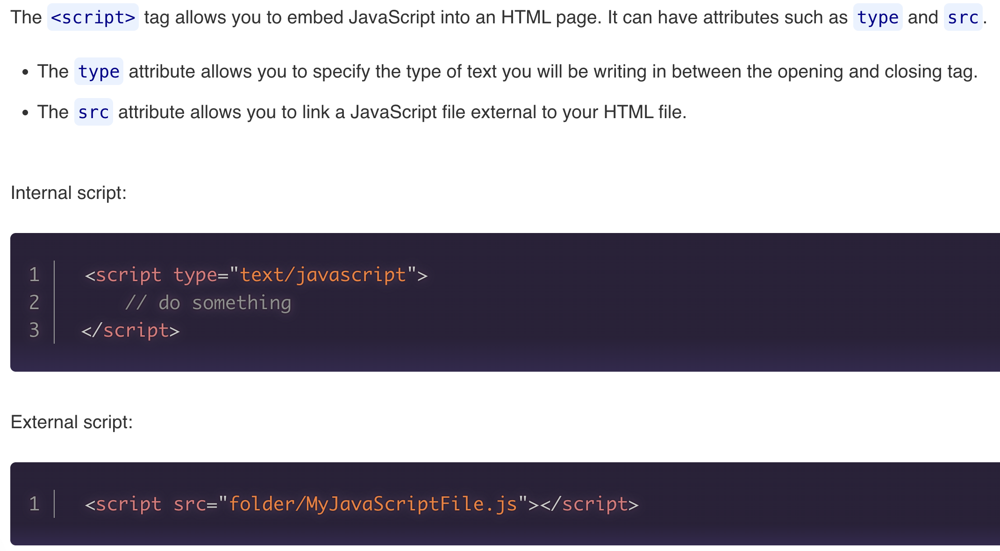

# Intro To JavaScript
-   High level - no access to CPU process (read/write to CPU)
-   Weakly typed - do not need to declare datatypes and can be fluid
-   Interpreted language by the browser NOT compiled

## Running JS File with Node.js
-   In terminal execute, `node fileName.js`

## Basic JS Grammar
-   case-sensistive
-   read top -> bottom, left -> right
-   statements - each individual action is considered a statement ended with a semi colon;
-   JS Comments:
    -   // - single line comments
    -   /**/ - multiline comments
-   Variables - a container in memory, that we can give a name and can store/retrieve values for our program
-   Code Blocks - are delineated/defined with curly braces {}

## Implementing JS/JS Files into HTML
-   Script tags should be incoporated either at the end of the body OR in head with a `defer` keyword.

## Primitive JS Data Types:
-   Numbers Types:
    -   integer (INT) - whole numbers, no decimal at all
    -   float - any number with decimal values
-   String - sequence of characters, including spaces, enclosed quotes (double, single, backtics)
-   Char - single character string
-   Boolean (Bool) - true / false
-   Null - does not have any datatype of value assigned. Null MUST BE ASSIGNED.
-   Undenfined - indicates a variable has NO value.

## Advanced JS DataTypes:
-   BigInt - for extremely large numbers

## let - keyword
-   block-scoped
-   reassignable
-   NOT redeclarable
-   is subject to hoisting

## cont - keyword
-   block-scoped
-   NOT reassignable
-   NOT redeclarable
-   is subject to hoisting

## Vocab:
-   literals - Numberic, Strings, Booleans values declared without a variable. Most often used for logic or console.log()
-   typeof - keyword used to find the type of a variable of literal. Always returns a string (can be used for compairison logic)
-   Concatenation - to add together (strings, objects, arrays, lists, tables)

## Arithmetic operators
-   `+` - addition
-   `-` - subtraction
-   `*` - multiplication
-   `/` - division
-   `%` - modulous (mod) - whole number remaining after division
-   `**` - exponentiation (to the power of)

## Compairison Operators - Always return a boolean value (True/False)
-   `>` - greater than
-   `<` - less than
-   `>=` - GTE
-   `<=` - LTE
-   `==` - loose comparison
-   `===` - strick comparison
-   `!=` - NOT compairison

## Logical Operators - allow us to combine comparison operators/boolean values into complex logical statements - always return True/False
-   Combined with parenthases and comparison operators you can create complex logical operations.
-   `&&` - AND operator - all combined statments must be true to return true
-   `||` - OR operator - one of the combined statements must be true to return true
-   `!` - NOT operator - returns the opposite of the boolean returned

## String Access
-   you can access individual indexs(char) of a list(string) using square bracket notation
-   Using index numbers you can access specific indexs
- We start counting at 0 zero

## BackTics
-   Creates a template literal - whatever whitespace or new lines is in your code, is represented in the string and YOU DONT NEED ESCAPE SEQUENCES FOR NEW LINES & QUOTES
-   String Interpolation - allows direct injection of JS logic and variables into a string, (same as f-string)
    - variables should by surrounded with `${}`